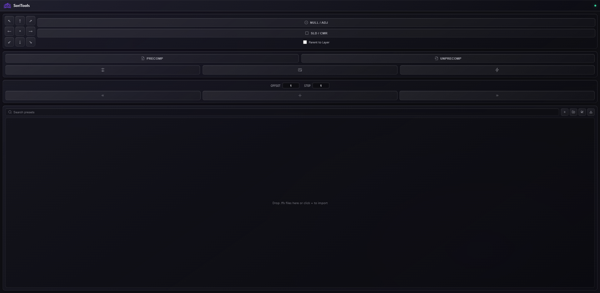

# SoriTools

SoriTools is an open-source Adobe After Effects CEP extension for fast daily motion-graphics workflow: anchor control, layer helpers, precomp/unprecomp, proxies, boost mode, timeline navigation, and animation preset management.



## Features

### Anchor Point

- 3x3 anchor-point grid
- Works on selected transform layers
- Keeps layer position visually stable while changing anchor point

### Layer Maker

- **NULL / ADJ**
  - Click: create Null
  - Shift + Click: create Adjustment Layer
- **SLD / CMR**
  - Click: create Solid
  - Shift + Click: create Camera
- Optional **Parent to Layer** checkbox for auto-parenting selected layers to the new helper layer

### Precomp / Unprecomp

- Precomp selected layers quickly
- Shift + Click Precomp: combine selected layers into one precomp
- Unprecomp selected precomposition layers
- Preserves common layer timing, effects, masks, keyframes, and time-remap-friendly footage workflows
- Writes debug info to `tmp/precomp-debug.json` and `tmp/unprecomp-debug.json`

### Effects Toggle

- Toggle effects in the current comp
- Shift + Click / Shift + Right-click: include nested precomps
- Restore-aware effect state handling

### Proxy Workflow

- Create and assign lightweight proxies for selected footage
- Toggle proxies on/off
- Reveal proxy folder and clear proxies from the proxy options menu
- Requires `ffmpeg` available in PATH for encoding

### Boost Mode

- Optimizes preview settings for daily work
- Profiles: Safe Daily, Strong Preview, Max Heavy
- Detects and bypasses heavy effects when configured
- Click: enable/restore Boost
- Right-click: profiles and refresh
- Shift + Click / Shift + Right-click: boost or refresh and set work area to selected layers

### Topaz Flow

- Render selected timeline footage to a project-local Topaz `IN` folder and open Topaz Video AI
- Watch Topaz `IN` / `OUT` folders and auto-import finished outputs back above the original layers
- Supports batch outputs that finish at different times
- Ignores temporary or zero-byte Topaz files while exports are still writing
- Prevents duplicate imports and double-click export/import races
- Shift + Click: manual `Import OUT` fallback
- Right-click: Import OUT, Reveal Folder, Clean IN

### Timeline Navigation

- Jump to layer in/out/center
- Offset and step controls for frame-based navigation
- Shift/Ctrl modifiers supported for timeline movement behavior

### Preset Library

- Import `.ffx` preset files or folders
- Search presets
- Create folders
- Drag/drop and reorder preset tree
- Apply presets by double-click or keyboard shortcut
- Export preset library

## Installation

### 1. Download or clone

```bash
git clone https://github.com/donylukmansyah/SoriTools.git
```

### 2. Install dependencies

```bash
cd SoriTools
npm install
```

### 3. Copy to CEP extensions folder

Windows CEP extensions folder:

```text
C:\Users\<YOUR_USER>\AppData\Roaming\Adobe\CEP\extensions\Sori Tools
```

macOS CEP extensions folder:

```text
~/Library/Application Support/Adobe/CEP/extensions/Sori Tools
```

### 4. Enable unsigned CEP extensions if needed

Windows registry:

```text
HKEY_CURRENT_USER\Software\Adobe\CSXS.11
PlayerDebugMode = 1
```

For newer versions, also check matching `CSXS.*` keys used by your After Effects version.

### 5. Open After Effects

Open After Effects, then load the extension from:

```text
Window > Extensions > SoriTools
```

## Compatibility

SoriTools targets After Effects via this host range:

```xml
<Host Name="AEFT" Version="[16.0,99.9]"/>
```

Tested target range:

- After Effects 2020
- After Effects 2021
- After Effects 2022
- After Effects 2023
- After Effects 2024
- After Effects 2025
- After Effects 2026

## Project Structure

```text
CSXS/                 CEP manifest
panel/                HTML, CSS, JS, and ExtendScript logic
panel/js/app.js       CEP panel runtime
panel/jsx/main.jsx    After Effects ExtendScript logic
presets/              Real .ffx preset assets
public/               Public images and UI assets
tmp/                  Local debug/restore state files
```

## Development Notes

- This is a plain CEP extension, not a bundled app.
- No build step is required.
- Keep ExtendScript compatible with older After Effects scripting engines.
- `tmp/` contains local debug/restore files and should not be committed.
- `node_modules/` should not be committed.

## License

Open-source project. Add your preferred license file if you distribute it publicly.
